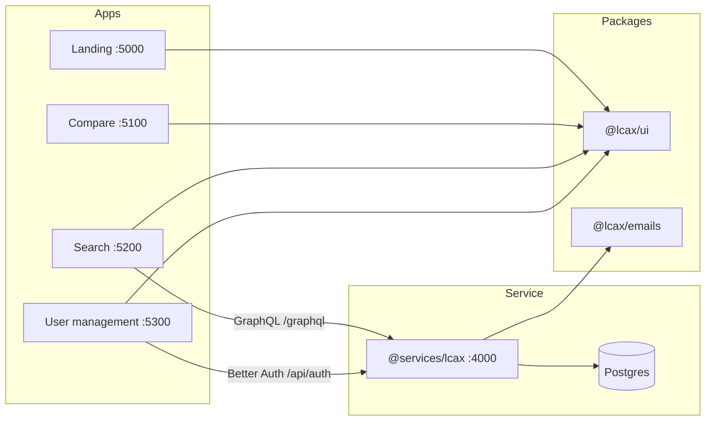

# LCAx Apps

**Transparent, accessible, and open LCA for the construction industry.**

This monorepo is the product surface around [LCAx](https://lcax.org) — an open, machine- and human-readable format for exchanging LCA results, EPDs, assemblies, and products. The apps here search, compare, convert, and manage that data.

[](https://www.apache.org/licenses/LICENSE-2.0)
[](https://lcax.org)
[](#workspace)
[](https://turbo.build)

---

## What lives here

| Package | Name | What it does |
| --- | --- | --- |
| [`apps/epd-search`](apps/epd-search) | `@lcax/search` | Catalog of organization-owned LCAx data. Search public EPDs and assemblies; members also see private records. |
| [`apps/compare`](apps/compare) | `@lcax/compare` | Convert LCAbyg / Real-Time LCA files to LCAx and compare up to three projects — **entirely in the browser**. |
| [`apps/user-management`](apps/user-management) | `@lcax/user-management` | Auth, organizations, invites, and profile. Federated into Search. |
| [`apps/lcax-landing`](apps/lcax-landing) | `@lcax/landing` | Marketing site for the LCAx project. |
| [`services/lcax`](services/lcax) | `@services/lcax` | GraphQL + REST API, Better Auth, Postgres (Drizzle). |
| [`packages/ui`](packages/ui) | `@lcax/ui` | Shared Mantine theme, layout, and components. |
| [`packages/emails`](packages/emails) | `@lcax/emails` | React Email templates (verify, invite, …). |

Search is a mixed catalog, not an EPD-only app: one list, type chips, public-or-member visibility. Compare never sends project files to a server.



---

## Quick start

**Prerequisites:** Node.js, [npm](https://docs.npmjs.com/cli/v8/using-npm/workspaces) (workspaces), [Turbo](https://turbo.build) (via local `devDependencies`), Postgres for the API, and [dotenvx](https://dotenvx.com) to decrypt `.env.dev`.

```bash
git clone git@github.com:lcax-dev/lcax-apps.git
cd lcax-apps
npm install
```

Copy or decrypt environment values. Root `npm run dev` loads `.env.dev` through dotenvx:

```bash
npm run dev            # all apps + API
npm run dev:search     # API + Search + User management only
```

| Surface | URL |
| --- | --- |
| Landing | http://localhost:5000 |
| Compare | http://localhost:5100 |
| Search | http://localhost:5200 |
| User management | http://localhost:5300 |
| API / GraphQL | http://localhost:4000/graphql |
| Auth | http://localhost:4000/api/auth |
| Email preview | `npm run email:dev -w @lcax/emails` → http://localhost:3003 |

Database migrations (from `services/lcax`):

```bash
npm run db:generate -w @services/lcax
npm run db:migrate -w @services/lcax
```

---

## Scripts

| Command | Purpose |
| --- | --- |
| `npm run dev` | Turbo `dev` with `.env.dev` |
| `npm run dev:search` | Search stack only (`@services/lcax`, `@lcax/search`, `@lcax/user-management`) |
| `npm run build` | Production builds (`dist/**`) |
| `npm run check` | Lint + format + typecheck via Turbo |
| `npm run format` | `oxfmt` across workspaces |
| `npm test` | Vitest (workspace) |

Per-package: `lint` / `lint:fix` (oxlint), `format` / `format:fix` (oxfmt), `tsc` (`tsgo` where available). Search also has `codegen` for GraphQL.

---

<a id="workspace"></a>

## Workspace

npm workspaces + Turbo. Layout:

```
lcax-apps/
├── apps/                 Vite + React 19 frontends
│   ├── compare/
│   ├── epd-search/       host MFE (port 5200)
│   ├── lcax-landing/
│   └── user-management/  remote MFE (login, orgs, profile)
├── packages/
│   ├── ui/
│   └── emails/
├── services/
│   └── lcax/             Express, Apollo, Drizzle, Better Auth
├── docs/
│   ├── adr/              architecture decisions
│   └── agents/           how agents use this repo
├── CONTEXT-MAP.md
└── turbo.json
```

Search and user-management are wired as Turbo microfrontends (`apps/epd-search/microfrontends.json`). Auth routes (`/login`, `/organizations`, `/profile`, `/accept-invitation`) are served by user-management.

### Environment

Turbo forwards these into tasks (see `turbo.json`). Values for local dev live in encrypted `.env.dev` — do not commit plaintext secrets.

| Variable | Used by |
| --- | --- |
| `DATABASE_URL` | API (Postgres) |
| `BASE_URL` | API / Better Auth |
| `FRONTEND_URL` | CORS + auth redirects |
| `BETTER_AUTH_SECRET` | Session signing |
| `VITE_BACKEND_URL` | Frontends → API |
| `VITE_DEV` | Frontend debug flags |
| `VITE_UMAMI_ID` | Analytics |
| `SMTP_HOST` `SMTP_PORT` `SMTP_USER` `SMTP_PASSWORD` `SMTP_FROM` | Transactional mail |

---

## Domain, in one page

Use the glossary in [`apps/epd-search/CONTEXT.md`](apps/epd-search/CONTEXT.md). Short version:

- **LCAx Data** — EPDs, Assemblies, and Products in the LCAx JSON formats.
- **Organization** — owns data; each user belongs to exactly one.
- **Visibility** — Public (searchable by anyone) or Private (owning Organization only).
- **Draft** — incomplete Private Assembly; never Public.
- **Roles** — `admin` (global), `owner` (org), `user` (org member).

Decisions that change search, visibility, or drafts live in [`docs/adr/`](docs/adr).

---

## Stack

- **UI:** React 19, Vite, React Router 7, [Mantine](https://mantine.dev) 9, Inter Tight
- **Data:** [`lcax`](https://lcax.org) library, Apollo Client, GraphQL
- **Auth:** [Better Auth](https://www.better-auth.com) + Drizzle adapter
- **API:** Express 5, Apollo Server, Drizzle ORM, Postgres (PGlite in tests)
- **Tooling:** Turbo, oxlint, oxfmt, Vitest, TypeScript (`tsgo`)

Visual language (editorial, architectural, one mustard accent) is documented in [`docs/agents/design.md`](docs/agents/design.md), distilled from Compare.

---

## Contributing

Issues live on GitHub: [`lcax-dev/lcax-apps`](https://github.com/lcax-dev/lcax-apps).

1. Read [`CONTEXT-MAP.md`](CONTEXT-MAP.md) and any ADR that touches your area.
2. Keep domain terms as defined in `CONTEXT.md` — don’t invent synonyms.
3. Match the Compare-derived design system when you touch UI.
4. Run `npm run check` and targeted `npm test` before you open a PR.

Agent conventions (issue tracker, triage labels, domain docs) are in [`AGENTS.md`](AGENTS.md).

---

## License

Apache-2.0. LCAx and these apps are developed by [Christian Kongsgaard](https://kongsgaard.eu), with support from Social- og Boligstyrelsen.

Further reading: [lcax.org](https://lcax.org)
